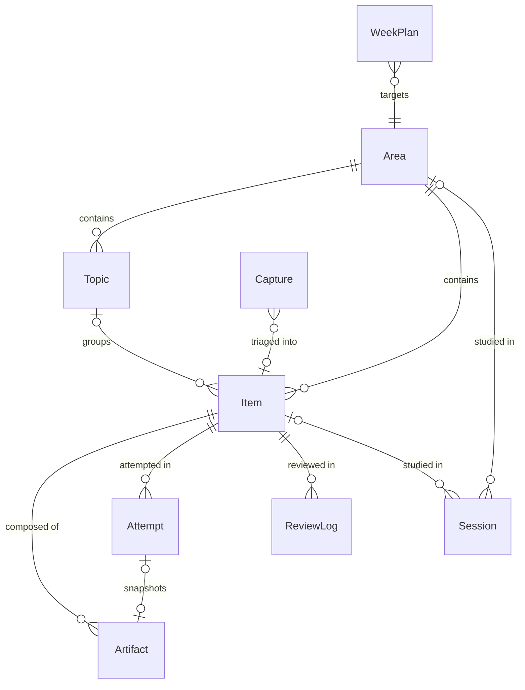

# Learning OS — Data Model

> Deliverable 2 of 3 for [product-brief.md](product-brief.md) §10. Companion documents:
> [architecture.md](architecture.md), [implementation-plan.md](implementation-plan.md),
> [open-decisions.md](open-decisions.md).

## 1. The one-sentence model

**One generic `Item` shell, specialized by a small `kind` preset and composed from typed `Artifact`
content blocks, with all history in append-only activity tables (`Session`, `Attempt`, `ReviewLog`,
`Capture`).**

Specialization happens through *configuration and composition*, never through per-area schemas.
That is the answer to §5's challenge, and §7 of this document tests it against all eight use cases.

## 2. Entity overview



State tables: `Area`, `Topic`, `Item`, `Artifact`, `WeekPlan`, `Settings`.
Append-only history tables: `Session`, `Attempt`, `ReviewLog`, `Capture`.
Derived cache: `MetricSnapshot`.

All IDs are UUIDs; every row carries `createdAt`/`updatedAt` (sync-friendliness, architecture.md §6).
Field lists below are conceptual, not a storage schema; `?` marks optional.

### Area

The top-level knowledge area (one per §6 use case, roughly).

| Field | Notes |
|---|---|
| `name`, `color`, `orderIndex`, `archived` | display and ordering |
| `weeklyTargetMinutes?` | feeds the consistency metric (§7) |
| `profile` | a **capability set** — see below |

`profile` is a small set of flags: `{ srsDefaultOn, attempts, timedExercises, canvas, video,
minimalMode }`. In the UI these are never shown raw; the user picks a **preset** when creating an
area — *Conceptual*, *Practice*, *Project-based*, *Time-only*, *Minimal* — which bundles the flags
and can be adjusted afterwards. Capabilities only *hide or show affordances*; they never change the
schema. This is deliberately a short, closed list — capability sprawl is a real risk (see
open-decisions.md T-6).

### Topic

An optional, flat grouping inside an area (`areaId`, `name`, `orderIndex`). One level deep, no
nesting (see open-decisions.md D-11). Items may belong to no topic.

### Item — the generic study unit

| Field | Notes |
|---|---|
| `areaId`, `topicId?`, `title` | the shell |
| `kind` | `note` · `practice` · `project` · `reading` |
| `status` | lifecycle — see §3 |
| `tags[]` | freeform; the `pattern:` namespace powers UC-1's weakness view |
| `estimateMinutes?` | set during Plan; optionally weights coverage later |
| `keyIdea?` | one line; the UC-6 "distilled key idea", surfaced prominently for `reading` items |
| `exerciseConfig?` | `{ targetMinutes, checklistArtifactId? }` — makes any item a timed exercise |
| `review` | embedded SRS state: `{ enabled, intervalIndex, dueDate, lastOutcome }` |
| `externalLinks[]?` | e.g. the UC-4 repository link |

**`kind` is a presentation preset, not a schema variant.** All four kinds live in one table with
identical fields; `kind` selects default artifacts, the default for `review.enabled`
(on for `note`/`practice`/`reading`, off for `project` — applied only when the area profile's
`srsDefaultOn` allows SRS at all), and how lists render (a `reading` list
shows the key-idea column; a `practice` list shows last-attempt results). There is intentionally no
`drill` or `exercise` kind: a drill is a `practice` item in a minimal-profile area (UC-5), and a
timed exercise is any item with `exerciseConfig` (UC-1/2/7).

### Artifact — typed content blocks

Content is *composed onto* items rather than baked into them: `{ itemId, attemptId?, type, role?,
payload, orderIndex }`.

| `type` | `payload` | Serves |
|---|---|---|
| `markdown` | text (code blocks included) | UC-1/2/4/6 notes |
| `canvas` | Excalidraw scene JSON | UC-2/6 diagrams |
| `video` | `{ url, notes: [{seconds, text}] }` | UC-3 timestamp-anchored notes |
| `link` | `{ url, note? }`; `role: "reference" \| "applied-here"` | UC-4's "where I applied this" |
| `checklist` | `{ entries: [{id, text, done}] }`; `role: "subtasks" \| "rubric"` | UC-4 project subtasks, UC-2/7 answer rubrics |

Two consequences worth naming:

- **New artifact types are additive** — no migration, no changes to Item. This is how phase 5's
  canvas and video land without touching anything built earlier (implementation-plan.md).
- **`attemptId?` makes snapshots first-class**: a UC-2 timed rehearsal ends by *copying* the item's
  canvas artifact with `attemptId` set. The snapshot is an ordinary canvas artifact — so it "remains
  editable later" exactly as UC-2 demands, while the attempt keeps a stable pointer to what was
  produced.

### Session — append-only

`{ areaId?, itemId?, startedAt, endedAt?, source: timer|manual, note? }`. The start/stop moment of
§4; the *only* required action in the whole product. `itemId` is set automatically when a session is
started from an item, `areaId` when started from an area — never asked for. At most one row has
`endedAt = null`. Manual entries allowed ("I studied 40 min offline") for UC-3 honesty.

### Attempt — append-only

One execution of an item: `{ itemId, at, durationSec?, result: pass|passWithHelp|fail,
plannedDurationSec?, checklistState?, note? }`.

This single entity carries three use cases: UC-1's problem attempts (result + duration, aggregated
by pattern tag), UC-2/7's timed exercises (`plannedDurationSec` from `exerciseConfig`,
`checklistState` = a checked copy of the item's rubric, snapshot artifact attached), and UC-5's
done-toggle — **marking a drill done just logs `Attempt{result: pass}`**. No special case, one tap.

### ReviewLog — append-only

`{ itemId, at, outcome: pass|fail, intervalIndexBefore, intervalIndexAfter, dueDateAfter,
sourceAttemptId? }`. Every SRS decision is recorded — this is what makes a retention *trend*
reconstructible, which §7 of the brief explicitly requires history for. `sourceAttemptId` links the
UC-1 unification: for practice items, a real attempt **is** the review (see §4).

### Capture — append-only

The UC-8 inbox: `{ text, url?, at, context: { areaId?, itemId?, sessionId?, route },
status: inbox|triaged|dismissed, triagedToItemId? }`. Context is stamped automatically from whatever
is active — the user never picks a destination (§4). Triage happens in Review; a capture can become
a new item, attach to an existing one as an artifact, or be dismissed.

### WeekPlan, Settings, MetricSnapshot

- **WeekPlan** `{ weekStart, entries: [{areaId, targetMinutes?, focusItemIds[]}], note? }` — the
  §4 Plan moment's output: light weekly intentions, not a calendar (open-decisions.md D-5).
- **Settings** — singleton: `schemaVersion`, `lastExportAt` (backup reminder), day-boundary and
  week-start preferences.
- **MetricSnapshot** `{ date, areaId?, coverage, retention, minutes }` — a derived daily cache,
  written opportunistically on first open of a day, so trend charts don't recompute months of
  history. Rebuildable from the append-only tables; losing it loses nothing.

## 3. The item lifecycle (§7)

```
untouched ──▶ in-progress ──▶ learned ──▶ mastered
                                 ▲  │         │
                                 │  ▼         ▼
                                 needs-review ◀┘
```

- `untouched → in-progress`: automatic on first session or attempt against the item.
- `in-progress → learned`: **manual**, typically during Review ("I've worked through this").
  Entering `learned` with `review.enabled` starts the SRS clock.
- `learned → needs-review`: **automatic** — the due date passes, or a review/attempt fails.
- `needs-review → learned`: a passed review.
- `learned → mastered`: automatic on passing a review at the top of the interval ladder.
- `mastered → needs-review`: a failed review — **mastery is not permanent** (§7). Mastered items
  keep a long repeat interval rather than leaving the schedule (open-decisions.md D-1).

Manual overrides are always allowed (the user disposes); only the two arrows marked automatic ever
happen without the user.

## 4. Spaced repetition — deliberately small (§8)

A fixed interval ladder, pass/fail grading, no ease factors:

```
intervals (days):  1 → 3 → 7 → 14 → 30 → 60 → 120 (mastered; repeats at 120)
pass  → climb one rung, dueDate = today + newInterval
fail  → status needs-review, drop to rung 0
```

- For `note`/`reading` items, a review is a self-assessment prompt in the Review queue: the item's
  title and key idea are shown; the user answers *"could I explain this?"* pass/fail. Not
  flashcards — a retention signal, per §8's "not a clone of a full SRS tool".
- For `practice` items, **the review is a real attempt** (UC-1: spaced repetition over practice
  items, not just cards): when an item is due, it appears in the queue asking to be re-solved;
  the logged attempt maps `pass → pass`, `passWithHelp → repeat rung`, `fail → fail`, and writes
  the `ReviewLog` row with `sourceAttemptId` set.
- **Retention metric** (§7): over items with `review.enabled` and status ∈ {learned, needs-review,
  mastered}: `retention = fresh / (fresh + stale)` where stale = `needs-review` (overdue or
  failed). Coverage deliberately does **not** drop when an item goes stale — that separation is the
  whole point of three numbers (§7).

## 5. The other two numbers

- **Coverage** (per area): items in {learned, needs-review, mastered} ÷ all non-archived items.
  Count-based in v1; estimate-weighting is an open decision (D-2).
- **Consistency**: minutes this week vs `weeklyTargetMinutes` (per area and global), plus a streak =
  consecutive days with *any activity* (a session **or** an attempt — so a UC-5 done-tick keeps the
  streak without a timer). Day boundary = local midnight (D-3).

## 6. Sync- and future-friendliness

UUID keys everywhere; `updatedAt` on state tables; history tables are append-only and never edited
(a mis-logged session is corrected by a compensating edit flag, or plainly deleted — see D-4). A
future sync layer gets union-merge on history and last-write-wins on state without remodeling. This
is the 80% of sync-readiness that costs nothing now; real conflict handling remains future work (§8).

## 7. The eight-use-case test (§5, §6)

| UC | What it needs | How the model serves it | Special case? |
|---|---|---|---|
| 1 · Algorithms | attempt history, pattern rollup, SRS over problems | `practice` items + `Attempt` rows; `pattern:` tags aggregated over attempts; reviews sourced from attempts | none |
| 2 · System design | canvas + templates, timed rehearsal, editable snapshots | `canvas` artifacts (Excalidraw libraries as templates); `exerciseConfig` + attempt-owned snapshot artifacts | none |
| 3 · Language | time logging, light capture, video-anchored notes | sessions (incl. manual) + `video` artifacts with `{seconds, text}` notes; profile keeps everything else off | none |
| 4 · Framework depth | markdown+code, projects w/ subtasks, repo link, "applied here" | `note`/`project` items; `checklist(role: subtasks)`; `externalLinks`; `link(role: applied-here)` artifacts | none |
| 5 · Raw practice | done/not-done + streak, nothing else | minimal-profile area; done-tick = `Attempt{pass}`; streak counts it | none |
| 6 · Research area | papers w/ key idea, projects, diagrams | `reading` items surfacing `keyIdea`; `project` items; canvas artifacts | none |
| 7 · Interview prep | reuse timed-exercise + checklist machinery across areas | its own area; items with `exerciseConfig` + `rubric` checklists — same `Attempt` machinery | *strained* — see below |
| 8 · Capture inbox | global capture, auto context, deferred triage | `Capture` table + context stamping + Review triage | none |

### Where the model strains (called out per §10)

1. **UC-7 cross-referencing.** Interview prep works cleanly as its own area reusing exercise
   machinery, but "rehearse a *system-design* question" naturally wants to point at an item in
   another area. The model's answer is a `link` artifact using an internal item URL — workable but
   second-class (no backlinks, no rollup across the link). A first-class `ItemRef` relation is the
   known extension if this bites; it is not built in v1. This is the model's weakest joint.
2. **Timestamp-anchored video notes (UC-3)** are the most specialized payload in the system. Storing
   notes inside the video artifact's payload keeps the model uniform but makes those notes invisible
   to any future global search over artifacts until extracted. Accepted for v1; noted in D-7.
3. **`keyIdea` (UC-6)** is a single-purpose field on the generic Item. It earns its place by §3's
   own rule (it changes what the reading list shows and how reviews prompt), but it is the kind of
   field that invites siblings ("difficulty", "priority", …). The discipline: any proposed new Item
   field must pass the same rule — *if it doesn't change a decision, it isn't added.*
4. **UC-5's minimalism is a UI promise, not a schema fact.** The schema always *could* attach notes
   to a drill; the minimal profile hides the affordances. The genericity test passes precisely
   because rejection of features is configuration — but it means friction discipline lives in the
   profile system, and profile sprawl is the failure mode to watch (T-6).
